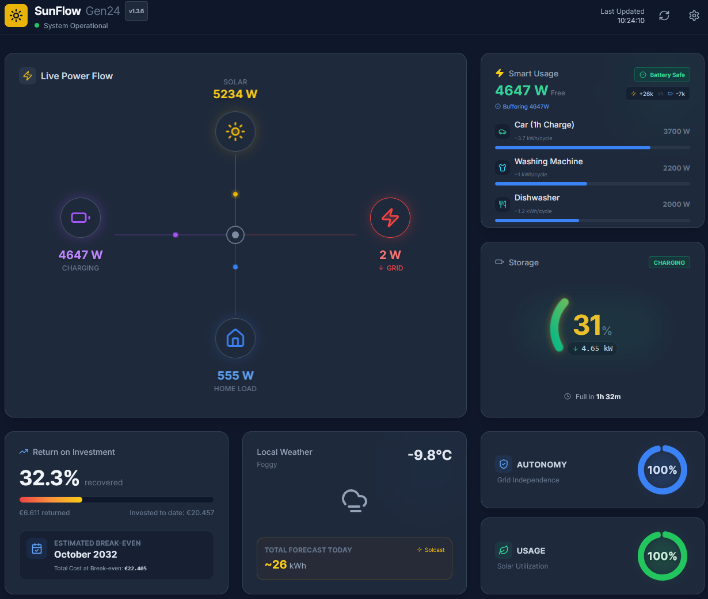
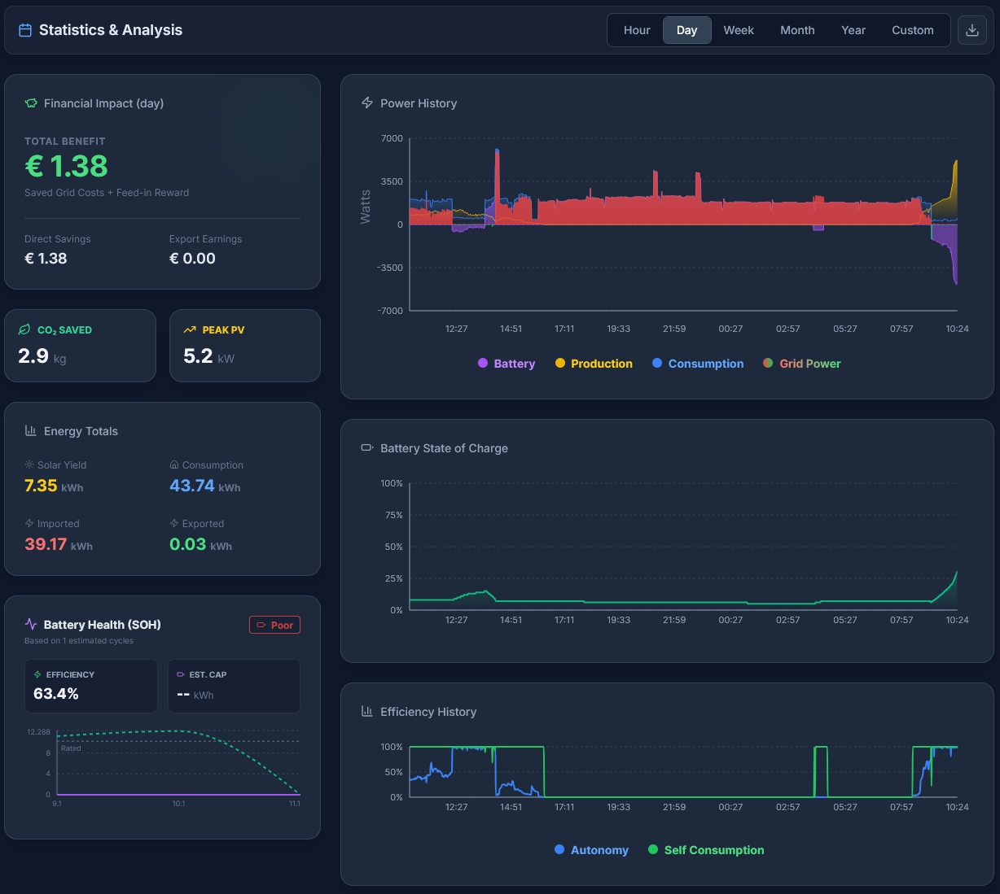

<div align="center">

  

  # SunFlow Dashboard
  
  **The Intelligent Companion for your Fronius Gen24 Inverter.**
  
  Stop guessing. Start optimizing. Track your ROI in real-time.

  <!-- Badges -->
  [](https://github.com/robotnikz/Sunflow/actions/workflows/docker-publish.yml)
  [](https://github.com/robotnikz/Sunflow/pkgs/container/sunflow)
  [](LICENCE)
  [](https://reactjs.org/)
  
</div>

---

> [!IMPORTANT]
> **Hardware requirement:** SunFlow is built specifically for the **Fronius Solar API** and targets the **Fronius Gen24 (Symo/Primo)** inverter family.
> If you **don't have a Fronius Gen24 inverter with Solar API enabled**, SunFlow will not be able to read live data (other inverter brands/APIs are currently not supported).

## ⚡ What is SunFlow?

SunFlow is not just another monitoring tool. While manufacturer apps are great for checking if your system is running, **SunFlow is designed for the system owner who wants to maximize value.**

It combines **real-time high-speed monitoring** (direct local connection) with **financial intelligence**. SunFlow calculates exactly when your system will pay for itself based on your specific installation costs and electricity tariffs.

Most importantly, it features a **24/7 Smart Energy Assistant** running on your server. It combines solar forecasts with your battery state to notify you exactly *when* to run your heavy appliances to maximize self-consumption—even if you don't have the dashboard open.

## ✨ Key Features

### 🧠 Smart Recommendations & Automation
Don't just watch the power flow—act on it.
*   **Server-Side Intelligence:** The backend continuously monitors surplus, battery SOC, and solar forecasts (Solcast).
*   **"Battery Safe" Logic:** The system calculates if there is enough sun left to fill your battery *and* run your washing machine. If not, it advises conserving energy for the night.
*   **Appliance Library:** Add your own devices (Sauna, EV, Dishwasher) with their specific power profiles to get tailored advice.

### 🔔 Smart Notifications (Discord)
Stay informed wherever you are.
*   **Proactive Suggestions:** Get a ping on Discord when it's the perfect time to run appliances.
*   **Safety Alerts:** Instant notifications for Inverter Errors, Battery Empty, or Battery Full events.
*   **Hysteresis Logic:** Intelligent alerting that prevents "notification bounce" by requiring state changes before re-notifying (e.g., dropping below 95% SoC before sending a new "Full" alert).
*   **Health Warnings:** Get alerted if your Battery SOH (State of Health) drops below a defined threshold.

### 📈 Upgrade Simulator (NEW!)
Experiment with your system before spending a dime.
*   **Scenario Planning:** Simulate adding more PV power (+200%) and/or a larger battery (up to 30kWh).
*   **Coupled ROI:** Shows the battery’s *incremental* benefit (PV-only → PV+Battery) so PV ↔ battery dependencies are visible.
*   **Historical Baseline (Correctness):** Uses your real hourly import/export where available so the “no-upgrade” baseline matches reality.
*   **Uses Available Signals:** If present, the simulator uses measured battery SoC and charge/discharge flows to improve realism (start state + limits/efficiency).
*   **Battery Sizing Hint:** Optionally suggests a “best value” battery add-on size based on your own history.

### ⚡ Dynamic Tariff Comparison (aWATTar)
See if a dynamic market-based tariff would have been cheaper for your household.
*   **Fixed vs Dynamic:** Compares your historic net cost using your configured fixed tariff vs aWATTar hourly market prices.
*   **Real Import/Export:** Uses your actual hourly grid import/export from the database (export is still credited at your configured feed-in tariff).
*   **All-in Assumptions:** Add a surcharge and VAT to approximate your full retail price (aWATTar provides exchange prices).
*   **Flexible Range:** Pick 7/30/180/365 days or a custom date range, with coverage stats shown.

### 🔋 Battery Health Guard
*   **SOH Tracking:** Automatically estimates your Battery's **State of Health** and **Efficiency** based on real charge/discharge cycles over time.
*   **Cycle Counter:** Tracks the estimated number of full cycles your battery has completed.
*   **Degradation Monitoring:** Visualizes capacity loss to help you claim warranty if needed.

### 💰 Financial ROI Tracker & Calibration
Solar is an investment. Track it like one.
*   **Amortization Countdown:** See the exact date your system breaks even.
*   **Hybrid Calibration:** Automatically syncs manual offsets with database-calculated totals for absolute accuracy.
*   **Granular Tariffs:** Supports changing energy prices over time (e.g., price hikes in 2024).
*   **CAPEX & OPEX:** Log installation costs, maintenance fees, or battery upgrades.

### 📊 Data Portability & Logic
*   **History Importer:** Import Home Assistant or Fronius CSV data. The system automatically "explodes" daily totals into hourly profiles for detailed chart resolution.
*   **Self-hosted Data:** Your data lives in a local SQLite database. No cloud delays, no data retention limits.
*   **Efficiency Metrics:** Track your **Autonomy** (Grid Independence) and **Self-Consumption** ratio over days, months, or years.
*   **Interactive Charts:** Zoomable, beautiful charts for Production, Load, Grid, and Battery.

---

## 📸 Screenshots

| **Live Dashboard** | **Analysis & Finances** |
|:---:|:---:|
|  |  |
| *Real-time power flow & Smart Suggestions* | *ROI Tracking & Long-term History* |

---

## 🚀 Getting Started

SunFlow is built as a lightweight Docker container. You can run it on a Raspberry Pi, a Synology NAS, or any server.

### Docker Prerequisites
1.  **Fronius Gen24 Inverter** (Symo/Primo) with `Solar API` enabled.
    *   *Enable via Inverter Web Interface: Communication > Solar API > Enable.*
2.  **Docker** installed on your machine.

### Method 1: Docker Compose (Recommended)
> [!TIP]
> For production, consider pinning a version tag (e.g. `ghcr.io/robotnikz/sunflow:<version>`) so updates/rollbacks are explicit.

Use the included `docker-compose.yml` in this repository (or create your own):

```yaml
version: '3.8'
services:
  sunflow:
    # Uses the public image from GitHub Container Registry
    image: ghcr.io/robotnikz/sunflow:latest
    container_name: sunflow
    restart: unless-stopped
    ports:
      - "3000:3000"
    volumes:
      # Persist database and config
      # Data will be stored in a 'sunflow-data' folder next to this file
      - ./sunflow-data:/app/data
    environment:
      - TZ=Europe/Berlin  # Set your Timezone!
```

Run it:
```bash
docker compose up -d
```

> [!IMPORTANT]
> **Upgrade safety (data/history):** keep your `./sunflow-data` directory when updating. If you delete or change this mount, SunFlow will start with an empty database.

> [!TIP]
> For upgrades, backups, rollback and troubleshooting, see [docs/OPERATIONS.md](docs/OPERATIONS.md).

### Method 2: Docker CLI

```bash
docker run -d \
  -p 3000:3000 \
  # Recommended (compat): bind mount to a host folder
  -v "$(pwd)/sunflow-data:/app/data" \
  -e TZ=Europe/Berlin \
  --name sunflow \
  ghcr.io/robotnikz/sunflow:latest
```

---

## ⚙️ Configuration

Once running, access the dashboard at `http://localhost:3000`.

1.  Click the **Settings Icon** (top right).
2.  **General:** Enter your Inverter IP (e.g., `192.168.1.50`) and System Capacity.
3.  **Notifications:** Add your Discord Webhook URL to enable push notifications for Smart Suggestions and Alerts.
4.  **Forecasting:** Add your Solcast API Key (Free Tier) to enable the "Battery Safe" calculation logic.
5.  **Tariffs & Expenses:** Add your grid costs and installation expenses to activate the ROI widget.
6.  **Appliances:** Configure your heavy consumers (Watts & Duration).

For day-2 ops (backup/restore, upgrades, common issues), see [docs/OPERATIONS.md](docs/OPERATIONS.md).

---

## 🔒 Security & Hardening

SunFlow is intended for self-hosting on a trusted network. If you expose it beyond your LAN, put it behind a reverse proxy with TLS and authentication.

- **Optional admin token (recommended):** set `SUNFLOW_ADMIN_TOKEN` and call write endpoints with `Authorization: Bearer <token>`.
- **CORS allowlist (recommended):** set `CORS_ORIGIN` to a comma-separated list of allowed browser origins (prod defaults to no cross-origin).
- **Reverse proxy setups:** set `TRUST_PROXY=1` so rate limiting and IP logic work correctly.

For details and additional recommendations see [docs/AUDIT.md](docs/AUDIT.md).

Practical checklist for self-hosting: [SECURITY.md](SECURITY.md).

Operations runbook (backup/restore, upgrades, troubleshooting): [docs/OPERATIONS.md](docs/OPERATIONS.md).

---

## 🤝 Contributing

See [CONTRIBUTING.md](CONTRIBUTING.md) for developer setup, testing, and PR guidelines.

- Test strategy & scenarios: [docs/TESTPLAN.md](docs/TESTPLAN.md)
- Quick manual UI regression checklist: [docs/UX_CHECKLIST.md](docs/UX_CHECKLIST.md)

---

<div align="center">
  <sub>Built with ☀️ and ☕ by Robotnikz</sub>
</div>